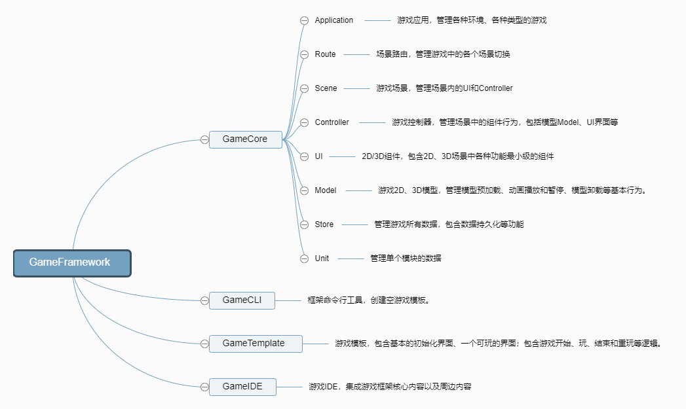

# 游戏框架概述

游戏框架采用MVC架构设计，支持多平台一键部署（微信小游戏、H5、APP），目前框架处于开发阶段，暂不能运用于实际生产环境。

# 路线图

- [x] MVC框架完善 [2018.6.20 liuhong1happy] 
    - [x] Application 入口层，管理应用部署配置
    - [x] Model层
        - [x] Store 管理所有数据，支持数据持久化
        - [x] Unit 管理单元数据
    - [x] View层
        - [x] Scene 场景管理，管理场景中的所有2D/3D元素，注入Controller对2D/3D元素进行管理
        - [x] RouteHistory 路由堆栈，切换场景
        - [x] UI 2D元素，基类为Component，抽象所有2D元素
        - [x] Model 3D模型，基类为Model，所有衍生模型最好都继承Model类
    - [x] Controller层
        - [x] Controller 通过数据驱动2D元素和3D模型
- [ ] 新特性引入
    - [ ] 动画库（选Tween.js） 用于支持场景过渡、2D元素或3D模型基本的动画
    - [ ] 物理引擎 （未定） 用于游戏中支持物理场景的情况，例如地形、障碍物等
    - [ ] 常用游戏算法
- [ ] 框架命令行工具 - 脚手架
    - [ ] 快速初始化项目代码
    - [ ] 初始化模块（主要是Scene、Component、Model、Unit、Controller）
    - [ ] 快速发布和部署（此处可能需要结合后端）
- [ ] IDE 可视化开发环境 - 选择定制VSCode
    - [ ] 代码编辑
    - [ ] 内置命令行工具支持